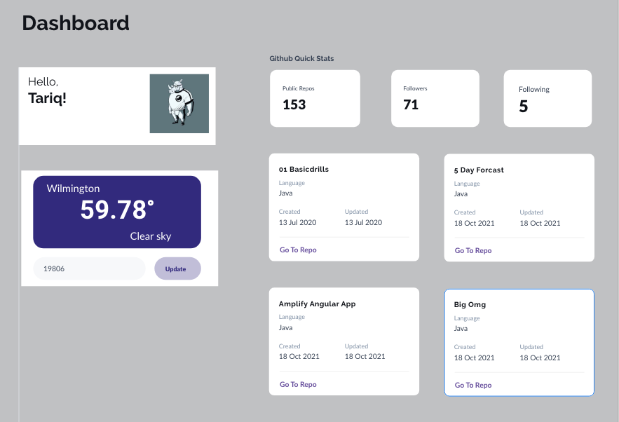

# My First Dashboard

Over the next few days , we will be completing the client and the server for this application.



This application collects data from two data sources

* Open Weather API
* GitHub API

You are going to use your Spring Server to collect the data from both api's and then display that in your REACT front end.

Lets get Started:

Here is a sample of the Open Weather API JSON: 

```
{
    "coord": {
        "lon": -75.5635,
        "lat": 39.7571
    },
    "weather": [
        {
            "id": 804,
            "main": "Clouds",
            "description": "overcast clouds",
            "icon": "04d"
        }
    ],
    "base": "stations",
    "main": {
        "temp": 59.94,
        "feels_like": 58.82,
        "temp_min": 56.34,
        "temp_max": 63.64,
        "pressure": 1020,
        "humidity": 68
    },
    "visibility": 10000,
    "wind": {
        "speed": 4,
        "deg": 111,
        "gust": 8.01
    },
    "clouds": {
        "all": 90
    },
    "dt": 1635103122,
    "sys": {
        "type": 2,
        "id": 2010476,
        "country": "US",
        "sunrise": 1635074529,
        "sunset": 1635113423
    },
    "timezone": -14400,
    "id": 0,
    "name": "Wilmington",
    "cod": 200
}
```

Let's discuss in class next steps!